# Ingest Health Deployer, UI user guide

A step-by-step walkthrough of the deployer. It takes you from a running container to four ingest-health
detections, a Hyperautomation watchdog, a review dashboard, and a nightly refresh, deployed to your
SentinelOne tenant against a baseline each feed builds from its own history.

The tool baselines the **expected event volume** per source (and optionally per device) over a trailing
window, then alerts when a feed goes dark, drops, floods, or appears for the first time with no
baseline. A broken or blind feed means every detection built on it is silently dead, and this is what
the deployer watches for.

The UI is twofold: it **configures** the ingest-health solution and **deploys** that configuration to
your SentinelOne console. Deploying is a **one-off** step; subsequent edits and tuning are done in the
S1 console, not here. Everything the deploy creates carries your naming **prefix**, and the deployed
artifacts (with live console / Data Lake links) are listed when the deploy finishes, so the config is
easy to find in the console.

---

## What it deploys

| Detection | Fires when | Mechanism |
|---|---|---|
| **SILENT** | an established feed produces **zero** events now (feed dark / broken / blind) | Hyperautomation watchdog (anti-join LRQ, posts an OCSF alert) |
| **DROP** | volume far **below** baseline but not zero (feed degraded) | scheduled detection |
| **SPIKE** | volume far **above** baseline (loop / misconfig / flood; also an ingest-cost signal) | scheduled detection |
| **NEW** | a feed ingesting now with **no baseline** (unexpected / first-seen feed) | scheduled detection |

Plus a per-entity ingest-volume **baseline** (SDL datatable), a tabbed **review dashboard**, a nightly
**baseline-refresh** flow per baseline, and (optionally) a daily **error notifier** flow.

SILENT is a watchdog rather than a scheduled rule because the scheduled-detection engine runs on a
pre-aggregated layer with no `left join` / `dataset`, and SILENT needs the baseline datatable joined to
live volume. So it runs as a Hyperautomation LRQ that posts one OCSF S1 Security Alert per dark feed.

---

## Before you start

You need two things: your **console URL** (for example `https://your-tenant.sentinelone.net`) and an
**API token**. That pair is enough to deploy the scheduled detections.

To also get the review dashboard and the SILENT watchdog alert, fill the SDL and ingest values in the
Connect panel. The HEC ingest authenticates with your console API token, so there is no separate HEC
token to manage. Nothing is written to disk; the token stays in the local server's memory for the
session and every SentinelOne call is proxied server-side, so no credential reaches the browser.

### Credentials

| Field / key | Required for | Where to get it |
|---|---|---|
| MGMT Console URL (`S1_CONSOLE_URL`) | Everything (required) | Your tenant Mgmt Console URL, no trailing slash. |
| MGMT Console API Token (`S1_CONSOLE_API_TOKEN`) | Everything (also authenticates HEC ingest) | Mgmt Console, Settings, Users, Service Users, create one and copy the API token. |
| SDL XDR URL (`SDL_XDR_URL`) | Dashboard + live source discovery | Your SDL tenant URL, region-specific (e.g. `xdr.us1`). |
| SDL config write key (`SDL_CONFIG_WRITE_KEY`) | Deploying the dashboard and lookups | SDL, API Keys, Configuration Access Keys, Config Write. |
| SDL config read key (`SDL_CONFIG_READ_KEY`) | Reading dashboard / lookup config | SDL, API Keys, Configuration Access Keys, Config Read. |
| HEC ingest URL (`S1_HEC_INGEST_URL`) | SILENT watchdog alert | Region-specific ingest host (e.g. `ingest.us1`). |

Provide these three ways: paste them into the Connect panel, copy `.env.example` to `.env` and fill it
in (then `docker run … --env-file .env`), or export them in your shell. Optional extras
(`S1_ACCOUNT_ID`, `S1_DEFAULT_SITE_ID`, `INGEST_PREFIX`, server settings) are documented in
`.env.example`.

---

## Step 0: launch and connect

Run the published image:

```bash
docker run --rm -p 127.0.0.1:8888:8788 ghcr.io/pmoses-s1/s1-ingest-health-deployer:latest
```

Publishing to `127.0.0.1:8888` keeps the port reachable only from this machine (the deployer is
unauthenticated by default and drives privileged S1 calls). It uses port 8788 (host 8888), distinct
from `s1-ueba-deployer` (8799/8899), so both can run side by side. For network or shared use, add
`-p 8888:8788 -e INGEST_BIND_ALL=1 -e INGEST_AUTH_TOKEN=<secret>` and open `?token=<secret>`; the
server refuses to start network-exposed without a token.

Open **http://localhost:8888**. On first load the deployer shows only the Connect panel; the wizard
stays locked until you connect. Fill in the fields and click **Connect**. The **MGMT Console URL** and
**MGMT Console API Token** authenticate the console (the token also authenticates HEC ingest, so there
is no separate HEC token field); the **SDL + alert ingest** fields power the review dashboard and the
SILENT watchdog alert. On connect, the badge in the top right flips to "connected" and the tabbed
wizard unlocks.

No tenant? Click **Use offline** on the Connect panel to configure and **Save artifacts** (download the
zip) without a tenant, then deploy the artifacts later.

---

## Step 1: sources and scope

Choose the scope for the baseline and every detection:

- **Source level** baselines volume per `dataSource.name`. This is the common setup.
- **Device level** (optional) baselines volume per device field within the chosen sources, so a single
  quiet endpoint inside an otherwise-healthy feed still surfaces.

You can enable one or both levels; when both are on, the deploy builds and refreshes a baseline for
each.

Then pick which feeds to monitor. The default is **watch every source**: leave the source list empty
and new feeds are covered automatically, no reconfiguring. Trim known-good or intentionally-bursty
feeds with the **source-exclusion list** (by `dataSource.name`), or use **Inclusions** to watch only a
named allowlist. Live source discovery populates the picker when connected.

The **Naming prefix** (default `INGEST`) is prepended to every artifact the deploy creates: the
baseline tables, the detection names, the watchdog and refresh flows, and the dashboard. Use a distinct
prefix per scope or team so nothing collides; the prefix is also how you re-deploy or remove a set
safely later.

---

## Step 2: configure the deployment

Every value here has a production-ready default; you only change what you need.

| Option | What it controls |
|---|---|
| **Sensitivity (Z threshold)** | How far from baseline volume counts as an anomaly. Lower is noisier, higher is stricter. Applies to DROP / SPIKE under the Standard method. |
| **Baseline window** | How much history the baseline is built from: 7 days (quick, noisier), 30 days (recommended), or 90 days (seasonal). |
| **Baseline granularity** | Daily or hourly volume buckets. Hourly catches within-day feed gaps; daily is cheaper. |
| **SILENT floor** | Minimum baseline average events before SILENT considers a feed "reliably active", so a naturally low-volume feed does not alert every quiet hour. |
| **Cool off period** | Minutes to suppress a repeat alert for the same feed, so a persistent condition does not alert every run. |
| **Run cadence** | How often the detections re-evaluate: every 5 minutes (demo), 15 minutes, 1 hour (recommended), or 24 hours. |
| **Sensitivity method** | **Robust** (percentile p95/p05, resists bursty and skewed volume) or **Standard** (z-score on mean and stddev). |
| **HA connection (all flows)** | One SentinelOne SDL connection that every Hyperautomation flow binds to: the per-level refresh, the SILENT watchdog, and the error notifier. Pick an existing connection, or create one in place (see below). |
| **Operations support email** (optional) | Where the daily error notifier emails if any flow does not finish cleanly. Leave blank to skip the notifier. Details below. |
| **Source exclusions** (optional) | Watch all feeds except these. Populates `<prefix>entityExclusions.csv`, editable later in the console. |
| **Advanced: Inclusions** (optional) | The inverse: baseline and alert on ONLY the listed feeds. Populates `<prefix>entityInclusions.csv`. An enabled-but-empty allowlist is treated as off. |

### HA connection for every flow

Every Hyperautomation flow the deploy creates, the per-level refresh, the SILENT watchdog, and the
error notifier, binds one SentinelOne SDL connection. The **HA connection** row is a single dropdown of
the connections already on the target, so you never bind flows by hand.

If none exists yet, type a name in **new connection name** (leave blank for a default) and click
**Create SDL connection**. The deployer creates a Bearer connection on the target from the console
values you already connected with, then selects it. The token is stored encrypted on the console side
and is never written into any flow body. Once a connection is chosen or created the row **locks** so all
flows share the same one; use **change connection** to pick a different one before deploying. Custom
names are validated and sanitised, so spaces or special characters cannot break the deploy.

If you leave the connection as "none", the flows still import but arrive **unbound and inactive**; a
banner warns you, and you would need to bind and Activate each flow in the Hyperautomation UI. The
scheduled detections and the dashboard are unaffected either way.

### Operations support email and the error notifier

Fill **Operations Support Email** to deploy a daily **error notifier** flow. Scheduled to run last, it
reads the recent execution status of every flow this deployment created and, if any did not finish
`Completed`, emails a professional summary (the failed flow names plus the steps to re-run) to that
address. Comma-separate multiple addresses. Leave the field blank to skip the notifier entirely;
everything else still deploys.

### Exclusions and inclusions

Both take a paste-one-per-line list or a CSV upload. **Source exclusions** subtract known-good or bursty
feeds from the baseline and every detection (new feeds stay covered automatically). **Inclusions** are
the inverse and restrict scope to only the listed feeds. They can be combined; a feed in both is
dropped.

---

## Step 3: select detections and deploy

Select which of **SILENT**, **DROP**, **SPIKE**, and **NEW** to deploy (all four by default), then
click **Enable ingest health**. Two more buttons sit alongside it: **Save artifacts** downloads the
full deployment bundle (every query, rule body, HA flow with embedded queries extracted, and the
dashboard) as a zip without touching the console, and **Download deployment manifest** saves the
manifest of exactly what this config would deploy.

---

## What happens when you click Enable

The deployer runs the steps in order and streams progress to a console log:

1. Creates each baseline table as a fast schema **stub** so the detections resolve immediately, no waiting on a full-window scan.
2. Creates each selected scheduled detection (DROP / SPIKE / NEW) and enables it.
3. Imports the SILENT watchdog flow per enabled level.
4. Deploys the review dashboard.
5. Imports and **activates** one baseline-refresh flow **per baseline**, each bound to the HA connection and **staggered from local midnight** (source at 00:00, device at 00:30 in the timezone your browser reports) so their `savelookup` runs never overlap. It then triggers a **run now** on each to build every baseline for real over the trailing window; the console shows per-flow run status.
6. If an operations support email was set, imports and activates the daily **error notifier** flow, scheduled to run last.

Until the first refresh run finishes, the detections read the stubs (nothing fires off a stub). Each
refresh flow must be active for its baseline to build, and every flow needs the HA connection from
Step 2; if a flow is not active, activate it and Run it once, then check its Activity.

Detections show as Activating and become Active within the hour.

---

## Re-running safely

Re-running a deploy will not create duplicates. Any detection, watchdog, or dashboard that already
exists (same name or path) is skipped, and the console shows a notice to either use a different naming
prefix or delete the existing artifact first. To deploy a fresh copy alongside an existing one, change
the **Naming prefix** in Step 1.

---

## Deployment manifest

Every deploy produces a **deployment manifest**, a small JSON file listing exactly what was created:
the detection rules, the per-baseline refresh flows, the SILENT watchdogs, the error notifier, the
dashboard, and the baseline / exclusion / inclusion lookup tables, each by name or path. On a
successful deploy it downloads automatically; you can also grab it any time with **Download deployment
manifest** in Step 3.

Keep the manifest. Re-uploading it is the reliable way to remove or update this exact deployment: it
deletes precisely the artifacts it lists and nothing else, independent of whatever prefix or scope is
currently selected in the UI. That also makes it the cleanest way to **update** a live deployment,
delete from the manifest first, then reconfigure and redeploy.

---

## Removing a deployment

There are two ways to remove a deployment, both in the **Danger zone** at the bottom of Step 3:

- **Delete deployed config** removes ONLY the artifacts named with the current prefix + scope: the detection rules, the per-level refresh flows, the SILENT watchdogs, the error notifier (all deactivated first), the dashboard, and the baseline / exclusion / inclusion lookup tables, and nothing else. You confirm by typing `confirm`.
- **Delete from manifest** takes a manifest file you saved from an earlier deploy and removes exactly what it lists, even if the UI is now pointed at a different prefix or scope. This is the safest option when you deployed several configs and want to tear one down precisely, and it is how you update a deployment.

Use either as a fallback; day-to-day editing of the deployed config happens in the S1 console.

---

## Reading the review dashboard

The deploy publishes a tabbed review dashboard in the console (Dashboards, named
`<prefix> <scope> Ingest Health`). An **Overview** tab summarises live volume and feed health, and each
detection gets its own tab with a live count, the top anomalous feeds, and a detail table. When both
levels are deployed, the dashboard spans source and device in one place.

---

## Deployment architecture



The diagram shows what a deploy creates and how the pieces relate: the deployer and its one SDL
connection, the Hyperautomation flows (per-baseline nightly refresh, the SILENT watchdog per level, and
the error notifier) that every bind that connection, the ingest-volume baselines and lookups in the
Data Lake, and the scheduled detections and alerts in the Operations Center. The header links open the
live versions from the running app: **Deployment architecture** renders this diagram, and **How it
works** opens this walkthrough. Both are served locally by the deployer, so they match the version you
are running.

---

## Troubleshooting

The debug log is **off by default**. Enable it with `INGEST_DEBUG=1`; when on, the server writes
request and step detail (with secrets redacted, and the file size-capped) to `ingest_debug.log` in its
working directory. In the Docker image the working directory is `/srv`:

```bash
docker run --rm -p 127.0.0.1:8888:8788 -e INGEST_DEBUG=1 ghcr.io/pmoses-s1/s1-ingest-health-deployer:latest
docker ps
docker exec <container> tail -n 200 /srv/ingest_debug.log
```

To keep the log outside the container, mount a volume and point `INGEST_LOG` at it. Running from source,
set `INGEST_DEBUG=1`; the log is then `ingest_debug.log` in the directory you launched from.

Common cases:

| Symptom | Cause and fix |
|---|---|
| Badge stays "not connected" | Console URL or API token is wrong. Re-check both in the Connect panel. |
| Source picker empty or "Loading sources…" | SDL / log-read access missing or the token lacks View Logs. Add the SDL values in the Connect panel. |
| A detection or dashboard is skipped | An artifact with that name already exists. Change the naming prefix, or delete the existing one, then re-deploy. |
| HA flows import but stay inactive | No HA connection was selected in Step 2. Pick or create one, or bind + Activate each flow in the Hyperautomation UI. |
| Dashboard or SILENT alert missing | The SDL and HEC values were not set. Reconnect with them filled in. |
